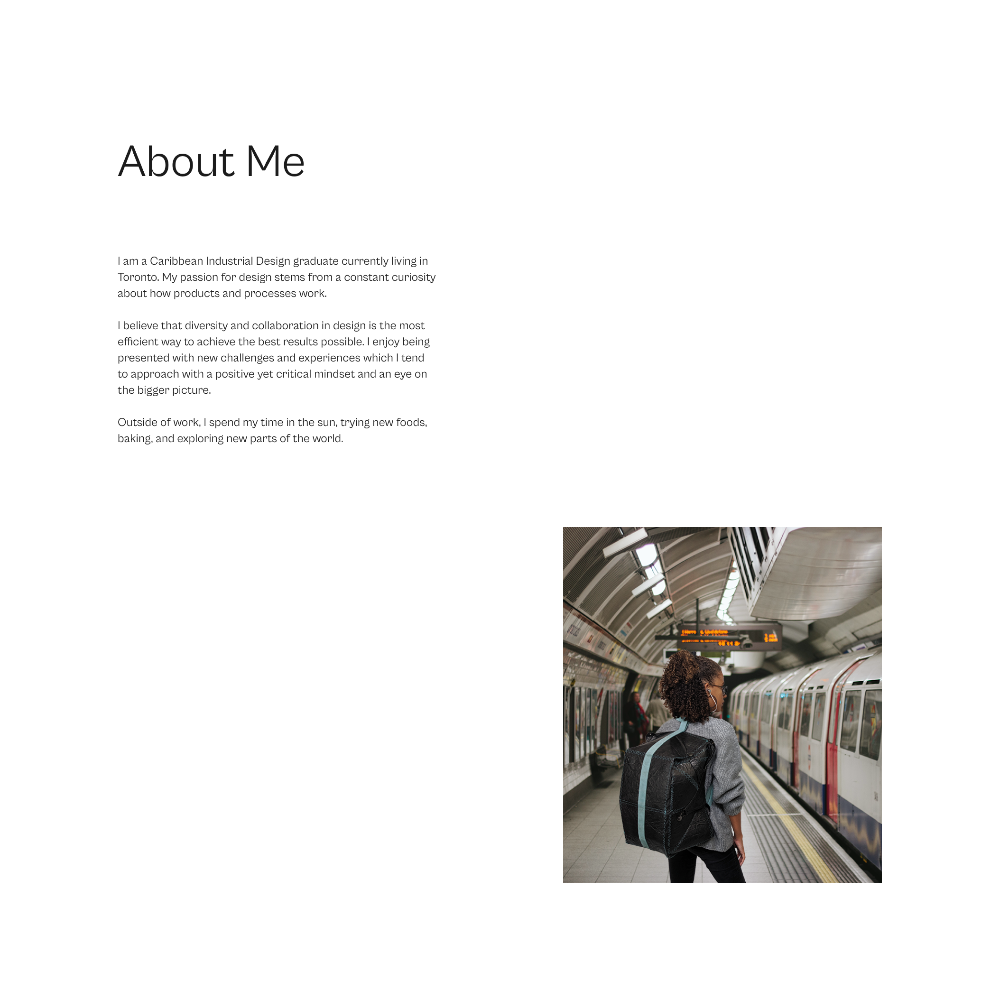

[Link to Project](https://dazzling-pika-20e680.netlify.app/) [Link to Repository](https://github.com/omnipoutine/adriane-spence-portfolio)

# Adriane Spence

## U.I. Design and Development.

Made with Gatsby, a React based open-source framework, using styled components and hosted on Netlify. This web application was designed with a minimal approach allowing the content to speak for itself.

To easily allow content to be published by Adriane, each project page and the about page is created dynamically using Markdown.

