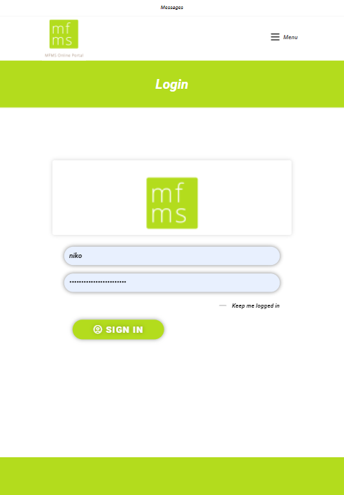
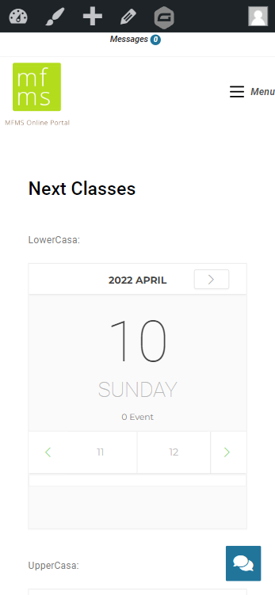
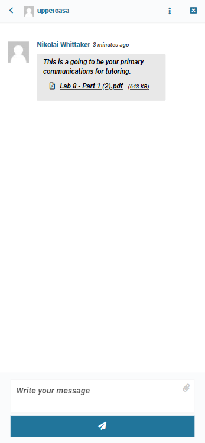
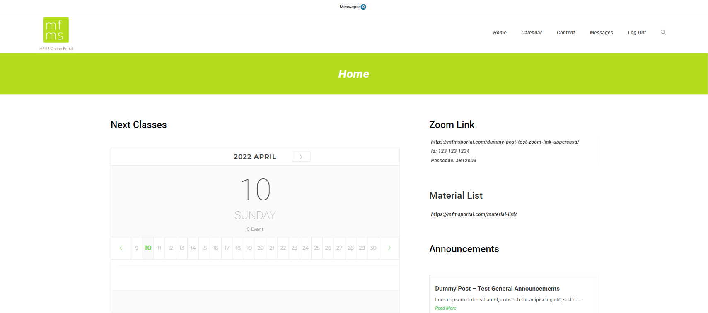

# MFMSPORTAL

## Web Developer

After the pandemic happened, My First Montessori, a brick and mortar montessori was in need of an online learning platform. After using a 3rd party application they decided to recruit some final year Algonquin college students to help them achieve that goal.

On a team of five students, we worked together to designed and fully developed an online learning application with a calendar and scheduling system, chat functionality and a load of handy forms to help the staff in the montessori.
    
While working on the team I was in charge of implementing the calendar system, updating the chat app functionality it restyling the website to fit more in line the the My First Montessori brand styling.

