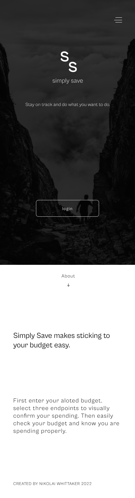
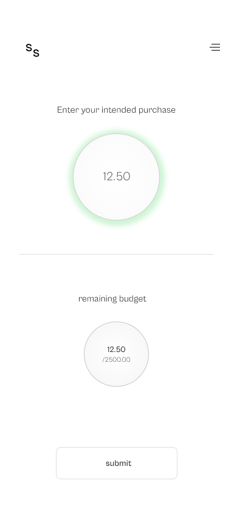
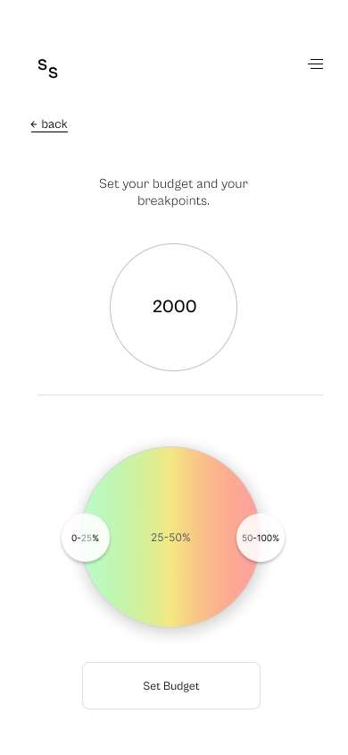

[Link to Repository](https://github.com/omnipoutine/Budget)

# Simply Save

## U.I Design and Development (Development in progress)

Simple budgeting app created using React and Styled components on the frontend and Python/Flask for CRUD operations and the backend. Also takes advantage of Auth0 for simple secure user authentication.

Usage of the app works with the user creating an account, setting their budget and warning percentages on the form page, and then entering their purchases to be removed from the budget. Once the budget is at zero further purchases will be taken from the next months budget which will be automatically adjusted at the end of the month.

